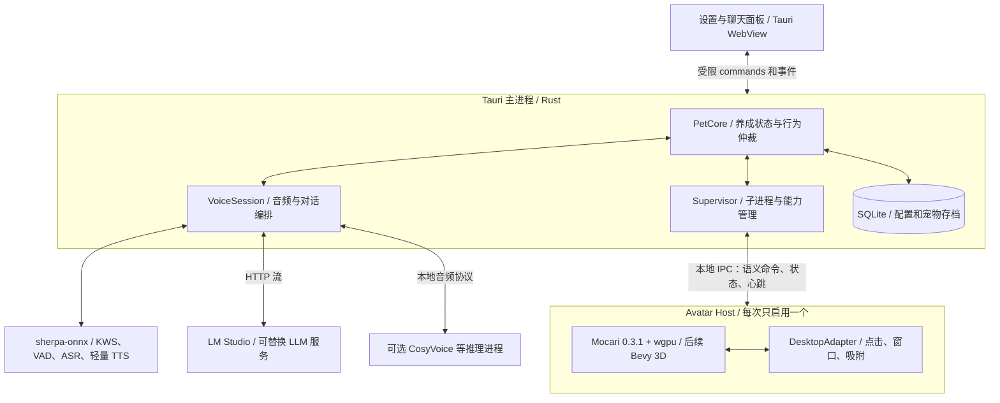

# 总体架构

## 推荐拓扑

以 Rust 为业务和原生运行主体。Tauri 负责托盘、设置、角色管理、聊天面板、应用生命周期；独立 Rust 图形进程负责透明宠物窗口。用户关掉设置窗口后，宠物仍运行。



Mocari 0.3.1 发布包示例使用 winit。macOS 原生窗口与事件循环有主线程要求，因此默认每个图形进程只拥有一个事件循环。Tauri 和 winit/Bevy 不在同一个进程各自调用 `run()`。Tauri 的外部程序打包能力可承载此方案，但签名、父子进程退出和焦点行为仍须 P0 实测。[Tauri sidecar](https://v2.tauri.app/develop/sidecar/)

同进程 Tauri 原生 Window + wgpu 可作为后续优化：由单一宿主驱动绘制，并确认 raw-window-handle、Surface 生命周期与主线程调用。P0 不同时实施两条宿主路线。普通 WebView 中执行 Rust 并不会自动获得原生 Mocari 画面。

## 模块边界与依赖方向

| 模块 | 职责 | 不应承担的职责 |
| --- | --- | --- |
| `pet-core` | 状态归约、需求值、行为选择、动作仲裁 | OS 调用、数据库调用、模型推理 |
| `pet-protocol` | 版本化 DTO、命令、事件、错误、能力位 | wgpu/ONNX/平台句柄 |
| `desktop-platform` | 屏幕、工作区、前台窗口信息、权限、吸附 | 决定饥饿值或生成对话 |
| `avatar-mocari` | 参数、表情、动画、口型、命中区映射 | 直接改存档和喂食奖励 |
| `audio-core` | 采集、重采样、环形缓冲、播放、时钟 | LLM 提示词与长期记忆 |
| `voice-session` | 唤醒、端点、轮次、流取消、管线调度 | 具体硬件算子实现 |
| `inference-*` | ASR/TTS/LLM 服务适配、探测与健康状态 | 操作桌面窗口 |
| `persistence` | SQLite 迁移、事务、存档恢复、历史清理 | UI 组件状态 |
| `app-tauri` | 组装、权限入口、托盘、进程监督、统一配置 | 每帧传输像素或网格 |

`pet-core` 只依赖纯数据/时间抽象；外围适配器依赖核心定义。起步可以用一个 crate 内的模块落实这些边界，只有独立构建或依赖冲突时再拆 crate。

建议最终目录如下，属于规划结构；目前已创建三个 `tools/p0-*/` 试件及根 Cargo workspace。P1-01 已新增 `crates/pet-core/` 和 `crates/pet-protocol/`；P1-02 已新增 `crates/pet-ipc/`、`apps/desktop/`、`apps/avatar-host-2d/`，P1-03 已新增 `crates/avatar-pack/`；其余模块尚未创建。当前最小契约与后续传输层边界见 [P1 实现记录](09-p1-implementation.md)：

```text
apps/desktop/             # Tauri 后端与薄 UI；Rust 偏好可用 Leptos CSR
apps/avatar-host-2d/      # winit + Mocari；原生 Rust
apps/avatar-host-3d/      # P5 才引入，Bevy 独立二进制
crates/pet-core/
crates/pet-protocol/
crates/pet-ipc/
crates/avatar-pack/
crates/desktop-platform/
crates/audio-core/
crates/voice-session/
crates/persistence/
crates/inference-sherpa/
crates/inference-http/
services/cosyvoice/       # 可选 Python 服务，独立环境
tools/asset-pipeline/     # Blender 脚本与角色校验
assets/demo/             # 可分发测试角色
docs/
```

设置 UI 可以少量 TypeScript 实现；若保持 Rust 编写，采用 Tauri 支持的 Leptos CSR 路线。这里的 Rust 优先指核心可维护性，不要求重写 sherpa 的 C++、成熟 Python 推理服务或 Blender 工具。

## 业务状态与行为

状态分三层，避免把所有组合塞进一个大枚举：

1. `PetNeeds`：饱食度、精力、心情、亲密度，标准化到 0–100；状态只由 Rust 核心写入。
2. `Activity`：Idle、FollowCursor、Dragged、Perched、Eating、Sleeping、Playing、ScreenPlay；动作含 ID、优先级、截止时间、可中断标记。
3. `VoiceState`：Disabled、Armed、Listening、Recognizing、Thinking、Speaking、Interrupted、Faulted；独立于宠物肢体动作。

行为第一版用有限状态机加效用评分即可。需求变化以注入的时钟与规则计算，候选行为由饥饿/精力/上下文/冷却决定。LLM 仅建议语气或受限动作，例如 `show_emotion("happy")`，必须经过核心白名单及当前状态检查。

仲裁优先级：退出/停止/权限撤销 > 用户拖拽与显式命令 > 当前语音互动 > 喂食等养成动作 > 主动行为 > 待机。开始拖拽即退出吸附和主动移动，结束后重新择位。

养成设计：喂食扣除一次道具库存并增加饱食；互动有冷却和收益递减；离线变化按经过时间计算并封顶，恢复时不会突然归零。运行中的计时采用单调时钟；重启后的 UTC 差值钳制在 0–24 小时，避免系统时钟回拨或久未启动导致异常。初期不引入虚拟死亡、复杂货币经济和支付。

## 事件与接口契约

以下是项目内部语义接口草案，不是 Mocari 或 Tauri 的原生 API。

| 接口 | 输入 | 输出/事件 |
| --- | --- | --- |
| `AvatarPort` | LoadPack、PlayAction、SetEmotion、SetGaze、SetLipEnvelope、SetPresentationMode | Ready、Hit、ActionFinished、BoundsChanged、Fault |
| `DesktopPort` | MovePet、AttachToTarget、Detach、SetInputMode、Hide | DesktopCapabilities、TargetChanged、PointerInput、PermissionChanged |
| `AsrPort` | 指定语言、完整 utterance 或受支持的流 | Transcript（注明 partial/final）、Timing、Failure |
| `TtsPort` | 文本、voice_id、style、turn_id | PCM Chunk、可选音素时间戳、End |
| `LlmPort` | 对话消息、受限动作 schema、取消令牌 | TextDelta、ActionProposal、Done、Failure |

所有适配器有 `probe`、`load/warmup`、`health`、`cancel`、`shutdown` 生命周期。探测仅说明可用候选；模型加载并通过 smoke test 才标记 ready。阻塞 FFI 使用专用工作线程，不占用 Tokio 或音频回调线程。

IPC 第一版采用继承的 stdin/stdout 管道、逐行 JSON 控制消息、stderr 日志。每条控制消息上限 256 KiB；带 `protocol_version`、`session_id`、`sequence`、`request_id`，按顺序解析和校验。主进程与子进程各自使用单调时钟，跨进程时间需握手建立偏移；不直接比较两个进程的裸时钟值。

```json
{
  "protocol_version": 1,
  "session_id": "app-session-01",
  "sequence": 42,
  "request_id": "feed-001",
  "type": "avatar.play_action",
  "payload": {"action": "eat", "priority": 60, "deadline_ms": 5000}
}
```

命令返回 accepted/rejected，再通过动作事件报告完成；有副作用的命令用 request_id 去重。取消/隐藏消息有独立高优先级队列。视线、鼠标位置、口型包络采用最新值覆盖；动作消息可靠有序。正常 10–30 Hz 语义更新，宿主内部 30/60 Hz 插值，不通过 IPC 传整帧图像。音频走独立有界二进制流，不放进 Tauri JSON events。

能力协商返回：角色支持的动作/表情/口型、平台是否支持全局定位/跨应用观察/穿透/快捷键、推理服务是否支持流式输入/输出/取消/时间戳。缺少能力时由核心选择替代动作，而不是让 UI 或模型适配器静默失败。

## 存储和故障恢复

SQLite 是存档唯一写入端：`pet_state`、`inventory`、`care_events`、`settings`、`schema_migrations`；聊天记录单独表，用户可关闭保存或清除。音频默认仅在内存中流转。首版记忆采用最近对话和用户确认的偏好，后续需要检索时再加向量库。

喂食操作使用事务提交库存、宠物状态和 request_id；动画失败不重复扣道具。定期快照、迁移前备份、异常关闭后按最近已提交状态恢复。UI 只有读取投影和请求操作的能力。

Supervisor 管理自建子进程，启动握手超时、心跳超时、指数退避，60 秒内连续失败 3 次后停止重启并展示可恢复错误。父进程正常退出通知关闭；宿主检测管道 EOF 或心跳丢失后退出，防止留下遮挡窗口。用户已有 LM Studio 属于外部服务，不随桌宠退出而关闭。

资源损坏时保持托盘入口，用内置测试形象或隐藏角色降级。GPU device lost 重建 Surface/设备失败后降低效果或重启宿主；TTS/LLM 失败时仍可喂食、拖拽、文字聊天。平台调用全部隔离，权限撤销作为运行时事件处理。
