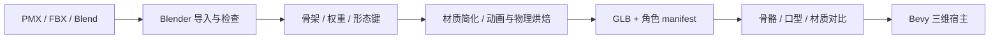

# 角色与美术资产管线

## 两条资产路径

| 路径 | 编辑工具 | 运行时 | 适合的交互 |
| --- | --- | --- | --- |
| Live2D `.model3.json/.moc3` | 参数配置；新增形变通常需 Live2D 源工程和相应编辑器 | Mocari 0.3.1 + wgpu | 视线、表情、口型、二维姿态、整体位移 |
| PMX / FBX / Blend → GLB | Blender；PMX 通过 MMD Tools | 后续 Bevy 三维宿主 | 转身、骨骼动作、身体运动、空间道具 |

Blender 不负责将现有三维骨骼模型直接变成可驱动的 Live2D `.moc3`。只有编译后的 moc3 也不能假定能恢复完整美术源工程。三维导出 PNG 序列可作为过渡渲染，但不能替代需要任意视角的三维管线。[Mocari 源码](https://github.com/Eatgrapes/Mocari)、[MMD Tools](https://github.com/MMD-Blender/blender_mmd_tools)

## P0/P1：纳西妲 Live2D

1. 从用户指定目录读取原始资源，生成开发用角色包副本；记录资源摘要，保持源文件不变。
2. 检查 `model3.json` 引用、JSON 格式、贴图大小、路径边界，加载 moc3 并枚举真实参数范围。
3. 将 13 个表情显式登记到副本的 `FileReferences.Expressions`，或通过适配器直接登记路径；按实际表情内容验证命名，不仅根据文件名推断情绪。
4. 保留现有嘴部和眨眼 Groups，校验参数是否真正存在；读取 CDI 显示信息辅助映射。
5. 配置头、身体的交互区域；优先使用模型实际 Drawable 或包内自定义多边形，不能编造 HitArea 的 Drawable ID。
6. 从程序化眨眼、呼吸、视线开始；进食先用开心表情、口型和二维道具演出。若不存在对应肢体变形，动作能力不宣称为“手持食物进食”。
7. 在浅色、深色桌面测试边缘、遮罩、混合模式、物理摆动；不能以单张截图证明所有表情兼容。

参数混合建议：默认值/基础动作 → 呼吸 → 视线 → 表情 → 眨眼及语音口型覆盖 → 物理更新 → 网格刷新。眼口需要参数所有权与权重：说话时口型优先；特定闭眼表情可覆盖自动眨眼；拖拽动作限制视线角度。实际 Mocari 调用顺序按 0.3.1 源码验证，不重复应用其内部已经执行的物理步骤。

适配器接收语义状态 `happy`、`look_at`、`mouth_open`；只有角色包知道它们对应哪个 Live2D 参数。切换角色时无需修改 PetCore。

## 角色包契约草案

以下是规划格式，首版实现后需要 JSON Schema 和版本迁移；不直接作为 Mocari 原生模型清单传入。

```json
{
  "schema_version": 1,
  "id": "nahida-local",
  "display_name": "纳西妲（本地资源）",
  "renderer": "live2d_mocari",
  "entry": "model/Nahida_1080.model3.json",
  "capabilities": ["gaze", "blink", "mouth_open", "expressions"],
  "parameter_map": {
    "mouth_open": "ParamMouthOpenY",
    "blink_left": "ParamEyeLOpen",
    "blink_right": "ParamEyeROpen"
  },
  "interaction": {"regions_file": "interaction.json", "anchor": "feet"},
  "actions_file": "actions.json",
  "license": {"status": "unverified", "redistributable": false}
}
```

动作清单至少含持续时间、是否循环、打断规则、回到待机的过渡、支持的情绪通道；缺失 `eat` 时映射到通用反馈，不造成不可恢复的动作等待。角色包路径只允许解析到包内；限制解压体积、贴图尺寸、网格数量。资产清单不携带可执行脚本。

二维逻辑空间以角色可视 bounds 定位，脚底锚点用于贴边；独立保存模型空间到宠物窗口的矩阵。视觉透明度与命中区域分别管理；挂件、发丝不一定适合承担拖拽区域。

## P5：三维资源处理

先比较可莉与哥伦比亚的美术工作量。可莉若有可用骨架、形态键和权重，就优先验证；哥伦比亚已确认没有这些数据，需要绑定、权重、表情和动画制作，不只是一轮格式转换。



导出任务：

- 记录 Blender 与插件版本；MMD Tools 在 Blender 5.0.0 的导入、材质和物理流程必须单独验收，不兼容时使用隔离的受支持 Blender 版本进行转换。
- 统一米制、朝向、原点与脚底锚点；处理 FBX/PMX 的比例和坐标差异，测试一个可辨认的左右手动作防止镜像错误。
- 将 PMX IK/约束烘焙成目标骨骼关键帧；头发、裙摆刚体先烘焙或暂时关闭，后续再用运行时弹簧骨/物理替代。
- 导出 `idle`、`look`、`eat`、`sleep` 等独立命名动作，动作重定向按骨骼映射做离线校验。
- 材质先使用简化且稳定的渲染方案，再补 toon、自定义轮廓、头发透明。MMD 的 toon/sph 和 Blender 节点材质不会自动等价于 glTF/PBR。
- 保留眨眼和嘴部 morph target。首版只要求开合嘴；多音素口型在 TTS 时间戳与角色能力都具备后启用。
- GLB 是第一标准；VRM 后置，VRM 的 humanoid、MToon、spring-bone、表情扩展不是“能加载 glTF”就全部支持。

Bevy 的官方样例已有 glTF 动画与 morph target 演示；这支持选择它作为三维候选，但不证明现有 PMX 转换后会自然等价。[Bevy 动画示例](https://github.com/bevyengine/bevy/tree/main/examples/animation)

三维宿主通过同一 Avatar 协议对接。Mocari/wgpu 和 Bevy 可分别锁定自己的图形依赖，避免要求两个生态使用相同 wgpu 类型。运行时只启动当前角色所需的一个宿主。

## 资产验收

| 项目 | 初始验收方式 |
| --- | --- |
| 引用完整 | 列出缺失文件与具体路径；不以 panic 退出应用 |
| 视觉一致 | 待机、左右看、眨眼、张嘴、全部表情在明暗背景下截图对比 |
| 可交互性 | 头/身体区域跟随缩放和位移；透明区域不吞点击 |
| 动作 | 切换不跳回错误位置；中断后恢复待机；不支持动作有降级 |
| 性能 | 记录纹理内存、CPU/GPU 帧耗时及加载峰值；二维先以 30 fps 为默认 |
| 三维 | 骨骼变形、morph、透明头发、脚底锚点、尺度和左右朝向逐项检查 |
| 分发 | 包含资产来源清单；构建使用明确允许分发的演示角色 |

具体三维网格/纹理预算以 P5 实测为准；本地 31,375 个顶点只描述已检查的 Blend，不作为其他模型的预算或质量结论。
