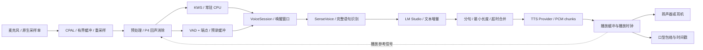

# 语音管线与硬件加速

## 第一条可交付链路

macOS 上先用 Rust 音频 I/O + sherpa-onnx 的 SenseVoice ASR + LM Studio HTTP 流式对话 + 可本地运行的轻量 TTS。优先按键说话；关键词唤醒、免按键端点检测、扬声器全双工依次加入。

用户熟悉的 CosyVoice 放在可替换 TTS 服务适配器后面，独立环境运行。第一轮可在耳机场景下验证语音和角色同步；在没有验证声学回声消除前，不将扬声器模式标记为可靠的全双工。

[CPAL](https://github.com/RustAudio/cpal) 提供跨平台底层音频 I/O；平台使用 CoreAudio、WASAPI 或 Linux 音频后端的具体支持由锁定版本和打包环境确定。CPAL 本身不提供完整 AEC。先录入设备信息，再按模型要求转换采样率；不能只修改音频头部来“变成 16 kHz”。

## 音频和会话契约

- 采集回调只拷贝到预分配环形缓冲，不做推理、网络请求、文件写入或阻塞锁。
- 初始内部分帧 20 ms；模型输入常用 16 kHz 单声道，实际以模型 manifest 为准。输出保留 TTS 原始采样率，在播放端转换为设备格式。
- 持续保留约 500 ms 的预录缓冲；唤醒后结合关键词边界裁切，避免吞掉首字或把关键词重复送入对话。
- KWS 与 ASR 为不同模型/任务。SenseVoice 在 sherpa 中属于非流式 ASR；“麦克风连续录入 + VAD 分段 + 句末识别”不等于真正流式 partial ASR。需要实时转写时再接支持在线解码的模型。[SenseVoice](https://k2-fsa.github.io/sherpa/onnx/sense-voice/index.html)、[sherpa C API](https://k2-fsa.github.io/sherpa/onnx/c-api/html/index.html)
- 唤醒词使用 sherpa 的自定义 KWS，但要遵守所选模型的词表/语言/分词方式，中文关键词验证误唤醒和漏唤醒，不能把任意字符串配置成功当成识别成功。[KWS 文档](https://k2-fsa.github.io/sherpa/onnx/kws/index.html)
- 初始端点参数：静音 600 ms 结束，最长语句 20 秒，无语音等待 8 秒结束；作为可调值，经中文停顿语料测试后更新。
- 每个轮次有 `session_id/turn_id/generation_id`；输入帧、文本片段和音频包均有序号，输出音频附 `sample_rate/channels/format/start_sample`。

默认半双工状态：Armed → Listening → Recognizing → Thinking → Speaking → Armed。任何状态允许用户停止；超时/设备故障进入可恢复 Faulted，UI 保留按键重试和文字输入。

## LM Studio 与文本流

Rust HTTP 适配器连接用户配置地址，默认示例为 `http://127.0.0.1:1234/v1`。启动检查服务可达性和真实模型 ID；不硬编码某个模型名称。对话请求使用 `/chat/completions`、`stream: true`，解析增量流、错误及结束标记。[LM Studio Chat Completions](https://lmstudio.ai/docs/developer/openai-compat/chat-completions)

保存 endpoint、model_id、上下文预算、超时和认证配置；支持流式文本是基线，工具调用和结构化输出需实际模型支持。LlmPort 把服务差异封装起来；不会为了使用兼容 API 而依赖云端 OpenAI 服务。

提示词包含角色性格、精简的 PetNeeds、最近对话和用户允许保存的偏好。不要将所有数据库历史或桌面内容自动输入模型。模型响应分成用户可听文本和受限动作建议；不读取或播放推理过程字段。未闭合 JSON、非法工具调用和未知动作均不执行。

分句器等待中文句末标点或长度/时间阈值，再提交 TTS；限制并发合成与待播总时长。短回复优先响应，长回复可边生成边播放。基线 TTS 即使只能整句输出，也可通过分句得到较早首段音频，但不要称为该 TTS 已支持文本/音频双流。

## TTS、口型和打断

Provider 能力分别报告 `stream_text_in`、`stream_audio_out`、`cancel`、`phoneme_timestamps`、`voice_clone`。CosyVoice 上游提供双流能力，但各版本、部署方式和设备实现要单独验证；不把宣传的延迟数字当成本机指标。[CosyVoice](https://github.com/FunAudioLLM/CosyVoice)

首版口型从即将播放的 PCM 计算 RMS 包络，平滑后驱动 `mouth_open`；用实际已播放 sample count 对齐画面，不从 TTS 请求时间或网络收包时间起算。播放停顿时嘴应合上。后续有音素时间戳和对应 blendshape 时再做多音素口型。

取消顺序：

1. 核心递增 generation_id，音频回调停止读旧 generation 的输出并清空待播队列。
2. 取消 LLM 网络流，通知 TTS 停止，关闭口型并让角色进入聆听姿态。
3. 所有迟到片段按 turn/generation 丢弃，不能再次排队播放。
4. 不支持硬取消的推理在工作线程完成或独立进程内结束；新轮次不等待旧音频播放。关闭 HTTP 连接不保证服务已释放 GPU，另行监控后端健康与资源。

P4 全双工在 VAD 前加入 AEC，参考信号取实际播放流；需要处理重采样、输出设备延迟、时钟漂移和蓝牙切换。播放期间出现语音只作打断候选，结合 AEC 后的近端语音检测确认。效果未通过时自动使用耳机或半双工模式，避免宠物声音唤醒自己。

## 加速抽象：按任务选择模型实现

不能只写一个 `Device = Metal | CUDA | ROCm` 就覆盖整个系统。渲染后端与推理后端各有自己的设备上下文，不共享 wgpu 纹理、CUDA pointer 或假设零拷贝。

每个可运行变体记录：`task/model_id/revision/sha256/format/tokenizer/frontend/runtime/runtime_version/provider/device/dtype/input_shapes/streaming/license`。缓存编译产物时还包括驱动、目标 GPU 和 shape profile。转换精度或后端后重新测质量。

探测顺序：枚举候选 → 检查安装库/驱动/硬件 → 检查模型与 provider 契约 → 加载并 warmup → 验证输出和时延 → 选择 → 运行监控。向 UI 显示“实际使用”的后端和回退原因，而不只展示“机器有 GPU”。

| 平台/硬件 | 渲染路径 | 语音/推理候选 | 验证要点与回退 |
| --- | --- | --- | --- |
| macOS Apple Silicon | wgpu Metal | sherpa/ORT CPU 基线；ORT CoreML、MLX、PyTorch MPS 或服务式 Metal 实现为候选 | CoreML 不是通用 Metal EP；模型/算子/shape/分区要匹配，失败回已验证 CPU 变体 |
| macOS Intel（后置） | wgpu 可用后端实测 | CPU；其他后端按硬件检查 | 不承诺 MLX GPU 能力，需独立打包与性能档 |
| Windows NVIDIA | wgpu DX12 等已验证后端 | ORT CUDA；必要时 TensorRT；外部 LLM/TTS 服务 | CUDA/cuDNN/驱动和导出兼容；CPU 兜底 |
| Linux NVIDIA | wgpu Vulkan | CUDA / TensorRT / PyTorch CUDA | 发行版、库版本、设备权限和显存预算 |
| Linux AMD | wgpu Vulkan | ORT MIGraphX 或模型支持的 PyTorch ROCm | GPU/OS/ROCm 支持矩阵及算子覆盖；不是任意 Radeon 自动可用 |
| Windows AMD/Intel | wgpu DX12 | ORT DirectML 或其他已验证提供程序；CPU | DirectML 有执行配置约束；不默认 ROCm 可用 |
| Linux Intel/CPU | wgpu Vulkan 或可用图形后端 | CPU；OpenVINO 作为按模型验证候选 | 未达性能档时限制模型规模，保留基本互动 |

此表是适配候选矩阵，只有 CPU 基线和后续逐项通过的组合才进入发行支持列表。sherpa 对某个模型和 provider 的封装支持也需检查；ORT 有某个 EP 不表示 sherpa 任意模型能使用它。[ORT EP 总览](https://onnxruntime.ai/docs/execution-providers/)、[CoreML](https://onnxruntime.ai/docs/execution-providers/CoreML-ExecutionProvider.html)、[DirectML](https://onnxruntime.ai/docs/execution-providers/DirectML-ExecutionProvider.html)

AMD 注意：官方说明 ROCm EP 自 ONNX Runtime 1.23 移除，建议迁移 MIGraphX；不能新建一个笼统的 `ort-rocm` 后端并假设最新版本支持。[ROCm EP 变更](https://onnxruntime.ai/docs/execution-providers/ROCm-ExecutionProvider.html)、[MIGraphX](https://onnxruntime.ai/docs/execution-providers/MIGraphX-ExecutionProvider.html)

## 本机推荐调度

M4 Max / 48 GB 的起始策略：

- KWS/VAD 常驻 CPU，避免 GPU 持续唤醒；ASR 先测 int8 CPU，满足目标即可保留。
- LM Studio 使用其自行管理的加载和硬件策略；应用仅知道外部服务健康，不能强制获得系统级 GPU 优先权。
- TTS 先选择本地 CPU 可达到实时速度的语音；CosyVoice/高质量服务加入后与 LLM 比较并发和串行两种时延。
- 应用内部用每设备预算与并发 semaphore 控制自己拥有的任务；在外部服务无资源遥测时采用保守并发上限。
- 初始给系统及其他应用保留至少 12 GB 余量；剩余预算包含模型、KV cache、纹理和临时峰值，按实测修订，禁止无限加载多个语音模型。
- 内存压力时先停止预取、限制上下文、卸载自管闲置模型、降低渲染 fps，再回退轻量模型。LM Studio 未开放的卸载能力不强行模拟。

GPU 不可用时切换 CPU 需对应可运行模型变体，不能只改一个配置枚举。重试/切换发生在语句边界；用户收到明确的状态说明。CPU 也无法实时运行的模型退到轻量 TTS 或文字，基础桌宠保持运行。

## 服务协议与封装

原生 sherpa 调用先放 Rust 专用工作线程，通过受支持 Rust 绑定或 C ABI 接入；FFI 对象构造/销毁和线程归属集中封装。可选重模型服务独立 Python 环境，避免把 CUDA、ROCm、PyTorch 和所有语音模型依赖塞进同一个发行包。

自建 TTS 服务控制面可用本机 HTTP，音频用带 metadata 的 WebSocket/二进制流；定义有界队列和最大待播时长（初始 3 秒），慢消费者触发背压，不能无限缓冲。仅监听回环地址，由父进程注入短期访问凭据；模型目录和服务配置不接受 LLM 自由修改。

P3 开发版允许连接用户已有服务；P6 发行版才确定哪些 runtime 随包、哪些作为可选组件。不要把 `/Users/ncy/Projects` 或开发环境绝对路径写死进产品。

## 测量标准

以下均为初始目标，基线为 M4 Max、48 GB、单角色 30 fps、固定短上下文与已 warmup 的指定模型。冷启动另测；每次记录模型 hash、tokenizer、runtime、provider、输入长度和并发场景。

| 指标 | 目标 / 测量定义 |
| --- | --- |
| 唤醒响应 | 关键词结束到 UI 聆听反馈 p95 < 300 ms |
| 端点等待 | 正常句末静音约 600 ms，可调；不能混入 ASR 运算耗时 |
| ASR | 5 秒中文语音，端点确定后识别 p95 < 500 ms，比较 CER |
| LLM | 请求发出到首个可显示文本增量 p95 < 800 ms；冷启动独列 |
| TTS | 首个完整分句提交到可播首段 p95 < 600 ms，持续合成 RTF < 1 |
| 端到端 | 用户实际说完到回复可听首音 p95 目标 < 3 秒，包含分句等待 |
| 停止播放 | 已检测打断事件到设备输出停止 p95 < 150 ms；蓝牙另列 |
| 口型 | 与实际播放时间偏差 p95 < 100 ms |
| KWS 质量 | 起始目标 FAR ≤ 1 次/8 小时、FRR ≤ 5%；按中文说话人、距离、噪声分组实测 |

分项 p95 不可简单相加当作端到端 p95。测试集至少含 100 条中文命令/闲聊、不同停顿、背景电视和宠物自声、30 次打断、耳机/内建扬声器/蓝牙切换；FAR 测试至少采集多个 8 小时背景段并报告样本量。先固定 CPU 质量基线，再比较加速后的精度、时延、资源与功耗变化。
