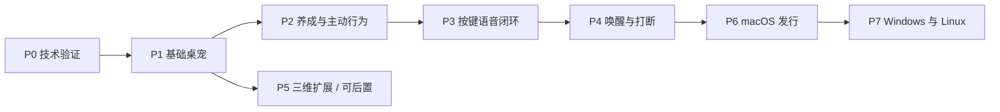

# 分阶段开发计划

## 范围和排期假设

以 1 名熟悉 Rust 与语音推理的开发者投入为估算，不包含额外美术制作、授权获取和模型训练时间。人日表示有效工作量而非承诺日期；阶段允许根据 P0 测量调整。P0 Gate 已通过，实际结果见 [P0 验证记录](07-p0-validation.md)；P1 已开始，P2–P7 尚未实施。

macOS 功能首版范围：一个 Live2D 角色、基本点击/拖拽、屏幕与已授权他应用窗口吸附、养成、可停止的主动互动、按键语音、关键词唤醒。扬声器全双工可以保留为明确实验能力；Windows/Linux 和三维不阻塞该版本。

## P0：最小技术验证，3–5 人日

目标：排除会改变架构的风险，不提前做复杂设置 UI。

当前状态（2026-09-18）：P0-01 至 P0-06 已按本机技术试件条件通过，**P0 Gate 通过，可进入 P1**。P0-02 已完成用户三轮眼口/表情与深浅背景确认；P0-06 已完成 30 分钟稳定性与 CPU/RSS 基线。平均 28.71 次 present/s，不宣称严格 30 fps 达标；物理、参考运行时完整一致性、正式 AX 跟随及关闭/撤权、混合 DPI 等专项保留后续验证。证据及适用范围见 [P0 实测记录](07-p0-validation.md)，以下通过条件保持不变。

| 任务 | 交付物 | 通过条件 |
| --- | --- | --- |
| P0-01 锁定版本 | Mocari =0.3.1、wgpu/winit、Rust 工具链与 Cargo.lock | 在本机 release 模式构建并记录版本 |
| P0-02 角色加载 | 纳西妲资源报告、参数列表、表情映射 | 模型可见；眼口参数和 13 表情逐个检查，损坏资源可报错 |
| P0-03 原生窗口 | Rust 透明窗口试件 | 深浅背景透明正确；启动与悬停不抢焦点，点击/拖拽允许角色取得键盘焦点；角色可拖拽，透明区点击落到其他 App（接受适量轮廓外命中余量） |
| P0-04 进程桥接 | Tauri 启停宿主、IPC 协议握手 | 退出后无残留进程；宿主崩溃可恢复；不同协议版本明确拒绝 |
| P0-05 平台试验 | 单屏坐标/多屏待测清单；AX 权限试验 | 无 AX 时屏幕吸附可用；获准后观察一个目标窗口移动 |
| P0-06 性能记录 | 首次加载、idle CPU/RSS、帧耗时基线 | 可稳定运行 30 分钟；记录实际瓶颈，不伪造目标达成 |

Gate：原生透明合成或点击穿透不能通过，不进入 P1 堆功能；先修改宿主输入方案。Mocari 对该角色不兼容时，记录具体遮罩/参数问题，使用可分发简单测试角色隔离；必要时评估另一 Live2D 后端，而非静默升级到主分支。用户需要看到具体取舍后才能确定是否更换指定版本。

## P1：基础 macOS 桌宠，5–8 人日

当前状态（2026-09-24）：P1-01 至 P1-03 已完成，P1-04 的动画、点击表情与视线范围获用户确认，P1-05 的坐窗位置、跟随与高度微调获用户确认；真实 100 次交互、多屏、三类窗口及性能等仍待验收。P1-06 已开始分组桌面测试，见 [P1-06 清单](14-p1-06-alpha-validation.md)。以下阶段整体目标保持不变。

依赖 P0。交付可常驻的本地 alpha：托盘、显示/隐藏、角色大小和位置、退出、基础角色包导入、头/身体点击、拖拽、视线、眨眼、屏幕吸附。他应用吸附作为独立权限能力加入。

- 实现 PetCore、AvatarPort、DesktopPort 最小契约；模型动画和位置更新留在宿主本地。
- 增加显示器工作区、负坐标和 DPI 映射；目标窗口最小化/关闭自动解除吸附。
- UI 可看权限/角色错误状态，授权被拒绝不影响普通桌宠。
- 建立无业务依赖的“隐藏/退出”路径，主进程故障时辅助窗口自行退出。

验收：100 次点击与拖拽脚本化清单、透明区域跨应用点击成功；至少 3 类应用窗口吸附；切 Space、睡眠唤醒、拔插显示器和快速拖拽有明确结果。普通动画目标 30 fps，帧时间 p95 ≤ 33.3 ms；能耗优化不能通过持续忙轮询达成。

## P2：养成、陪伴与主动互动，5–8 人日

依赖 P1。交付可在完全关闭语音/LLM 时使用的虚拟宠物版本。

- 饱食、精力、心情、亲密度；喂食、玩耍、休息；库存与冷却规则。
- SQLite 单写端、迁移、事务和 request_id 去重；重启恢复状态，离线变化封顶。
- 有限状态机与动作优先级；拖拽、喂食、睡觉、主动行为互相打断的明确规则。
- 先实现招呼、探头、邀请互动，再实现短时占屏；免打扰、频率和最长时间配置。

验收：重复提交一次喂食只扣一次库存；时钟前跳/回拨和中途崩溃不破坏存档；占屏到期总能退出，停止按钮/托盘生效；100 个可重复的行为序列无互斥状态冲突。关闭 LLM 后仍能完成全部养成互动。

## P3：按键语音与 LM Studio，6–10 人日

依赖 P2，也可在 P1 后按资源独立开发语音模块。交付可配置服务和设备的语音闭环。

- Rust 音频采集/播放、设备选择、正确重采样、麦克风权限。
- sherpa-onnx + 兼容 SenseVoice 模型；先核查本地 ONNX 项目能否直接复用，不符合则准备标准模型变体。
- LM Studio 健康检查、模型列表、流式文本、上下文裁剪和取消。
- TTS provider 第一实现（轻量 CPU 模型），CosyVoice HTTP 适配为可选；文本分句、音频背压、播放时钟驱动口型。
- 轮次 ID 和旧结果丢弃；服务断开、超时、模型未加载的界面反馈。

验收：固定 100 条中文样本上记录 CER/延迟；至少 50 轮完整对话无串轮、无累计音频缓冲；模型服务中断不让拖拽/养成卡顿。端到端温启动目标 p95 < 3 秒，失败则用测量拆分瓶颈，不把换模型后的不同质量结果混为同一基线。

## P4：关键词唤醒、打断与设备策略，7–12 人日

依赖 P3。分两个可独立验收的交付：P4a 关键词唤醒与半双工，P4b AEC 与扬声器全双工。

- 独立 KWS 模型、可配置中文唤醒词、预录缓冲、VAD 端点和唤醒超时。
- P4a 播放时关闭免按键录入或仅保留可靠的显式打断；按钮始终可停止。
- P4b 接入并验证 AEC、近端语音检测、输出参考流和设备切换后的重建。
- 实现 provider 探测、warmup、CPU 回退、模型变体选择及真实后端显示。
- 只选择 1 个值得优化的本机 ASR/TTS GPU 路径做对照，不同时重写所有模型后端。

验收：测 FAR/FRR，背景音和宠物自声不引起连环对话；30 次打断无旧音频复活；打断检测后停播 p95 < 150 ms（蓝牙单列）。模拟 GPU 不可用、OOM、服务重启、麦克风拔出/撤权，均有可恢复降级。

Gate：P4a 通过即可把“唤醒语音”纳入 macOS 首版；P4b 未通过时显示半双工或耳机模式，不承诺扬声器全双工已经完成。

## P5：三维角色扩展，6–12 工程人日，另计美术

依赖 P1 协议稳定，可以在首发后实施。先选骨架条件最好的模型；哥伦比亚需要额外绑定和表情制作，不能按简单转换估时。

- Blender 导入验证、骨骼/权重/材质/动画审计，输出一个 GLB 和角色 manifest。
- 独立 Bevy 宿主，实现与二维相同的行为/表情/口型协议和桌面能力。
- 三维射线/投影区域命中、脚底锚点、动画过渡、morph 口型；头发与裙摆物理后置。
- Toon 外观、透明头发、轮廓、骨骼变形做与源资源的视觉对照。

验收：同一组喂食、拖拽、语音事件在二维与三维角色中均有合理反馈，PetCore 不出现具体角色参数；加载一个缺失动作的包可降级。稳定性与性能单独测，三维未达标不降低二维发行质量。

## P6：macOS 打包与稳定性，5–8 人日

依赖 P1–P3、P4a；P4b/P5 为可选功能。

- 固定 Bundle ID 和支持系统范围；Developer ID 签名、公证、嵌套宿主/动态库签名和授权归属验证。
- 开发服务与发行依赖分离；主包包含已选定轻量能力，重模型可选安装或连接外部服务。
- 单实例、退出清理、崩溃日志、存档迁移、升级回退方案；自启动默认由用户设置控制。
- 清洁环境验证资源路径、模型缺失、离线启动、首次授权、更新后权限和模型缓存。
- 只打包可分发演示资产，用户原神角色保持本地导入方式。

验收：至少 8 小时混合场景稳定运行；无持续增长的内存和音频队列；macOS 首版 CPU fallback 可用。测试另一台目标 Mac 或干净账户；若没有第二设备，明确列为发行前未通过项。应用、宿主、WebView 的 RSS 分开记录再给总量，不能把外部 LLM 服务的内存忽略后声称“完整语音仅占几百 MB”。

## P7：Windows / Linux，10–20 人日起

依赖 P6 的协议与发行流程稳定。按平台单独排期，不承诺一次构建获得全部行为。

| 子阶段 | 内容 | 准入条件 |
| --- | --- | --- |
| P7a Windows | 透明窗口、焦点、DPI、WinEvent 吸附、WASAPI、安装包 | CPU 基线全流程；一组 NVIDIA 或 DirectML 组合专项验证 |
| P7b Linux X11 | 合成器与工作区、输入区域、窗口观察、音频与托盘 | 至少一个明确发行版/桌面环境测试，公开支持矩阵 |
| P7c Linux Wayland | 基础角色窗口与语音；可选 compositor 扩展 | 对不支持吸附/全局定位给出清晰降级；不得把 X11 结果当作 Wayland 结果 |

CPU 语音作为所有平台首个端到端基线；CUDA、MIGraphX、DirectML 等分别有模型/驱动/设备报告后再纳入支持范围。

## 总量与首两周建议

P0–P4 加 P6 约 31–51 人日（包含 P4b 的预留），单人约 6–10 个全职工作周；模型兼容性返工与美术投入另计。P5、P7 独立后置。不要先以本机 48 GB 的条件承诺低配设备同样效果。

首两周聚焦：前 3–5 天完成版本/纳西妲/透明窗口/进程桥接；接着完成点击拖拽、屏幕吸附、托盘与基础存档结构。P0 不通过则用于修复技术路径，不按日历强推后续阶段。

## 需求追踪与风险

| 用户需求 | 主要阶段 | 核心验收 |
| --- | --- | --- |
| 光标点击互动和窗口吸附 | P0/P1 | 跨应用点击穿透、屏幕与目标窗口分开验证 |
| 喂食陪伴 | P2 | 离线可用、存档一致、重复请求幂等 |
| 主动占屏 | P2 | 受频率控制、可停止、不因故障永久遮挡 |
| 关键词唤醒和语音对话 | P3/P4 | 按键闭环、KWS 质量、打断与自声隔离 |
| macOS 优先、跨平台 | P0/P6/P7 | 原生能力隔离、各平台实机验收 |
| Rust 与 Mocari/Tauri | P0/P1 | 指定 0.3.1 发布包基线、独立原生宿主 |
| 三维模型和 Blender | P5 | 骨架与动画准备、GLB/三维宿主适配 |
| 硬件加速 | P3/P4/P7 | 每模型每后端 smoke test、质量回归、CPU 降级 |

最大的早期风险是透明窗口/输入命中和 Mocari 对实际角色的兼容；中期风险是回声、推理资源竞争和跨进程授权；后期风险是三维美术工作量、发行依赖和 Wayland 能力差异。按上述 Gate 验证，可在发生问题时调整局部适配器，而非推翻养成和对话核心。
