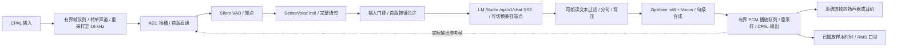

# P3 语音流水线设计：SenseVoice、ZipVoice 与 LM Studio

日期：2026-09-28。状态：**模型已放入 Git 忽略目录，LM Studio Rust 后端和 ASR/TTS 文件试跑已验证；麦克风、实时 VAD、扬声器及桌宠接线仍是实施计划**。这是 [语音架构](04-voice-and-compute.md) 的首个具体方案，P2 桌面验收仍独立进行。

## 首版边界与数据流

首版由用户按住说话，音频经 VAD 端点后进入 SenseVoice，识别结果先展示，再送 LM Studio，文字增量按句提交 ZipVoice，合成 PCM 进入**实际扬声器/耳机播放流**。播放样本计数驱动口型。播放时暂停自动麦克风受理；停止按钮始终可用。即使 VAD 误判，按键释放也必须 flush 当前语句。

`audio-core` 管理设备、采样格式、连续帧序号、环形队列、输出播放时钟与设备切换；`voice-session` 管理状态、轮次 ID、门控、分句和打断；`inference-sherpa` 封装原生模型对象及工作线程；已新增的 `pet-inference-http` 管理 LM Studio 的 HTTP/SSE。桌宠 UI 通过受限命令启动、停止、选择设备和显示文本，不传送原始 PCM。音频和权重默认只在本机内存与用户数据目录，不写入聊天存档。

## 本机模型与配置

模型现位于工作区的 `models/local/`，该目录被 `.gitignore` 排除。发行版需从用户选择的模型目录或应用数据目录解析相对路径，禁止将本机绝对路径编入程序。启动前检查所有文件、可读性、模型 revision 与哈希；仅文件存在不代表模型已成功加载。

| 任务 | 模型文件 | 初始策略 |
| --- | --- | --- |
| VAD | `silero_vad.onnx` | 16 kHz，512 sample 窗，CPU 1 线程 |
| ASR | `sherpa-onnx-sense-voice-zh-en-ja-ko-yue-int8-2025-09-09/model.int8.onnx` 和 `tokens.txt` | 16 kHz 单声道完整片段、`language=auto`、CPU 1 线程 |
| TTS | `sherpa-onnx-zipvoice-distill-int8-zh-en-emilia/{encoder.int8.onnx,decoder.int8.onnx,tokens.txt,lexicon.txt,espeak-ng-data}` 和 `vocos_24khz.onnx` | CPU 2 线程、`num_steps=4` 起测；输出采样率从合成器读取 |
| 克隆参考 | 用户选择的本地 WAV | 仅本机手动测试，音频路径和内容均不提交、复制到示例包或遥测 |
| LLM | `http://127.0.0.1:1234`、`qwen/qwen3.6-35b-a3b` | 可配置示例值；先查 `/v1/models`，再以真实生成确认可用 |

本机验证所用参考音频为单声道 44.1 kHz、约 12.96 秒。ZipVoice 的 Rust API 接收 `reference_audio` 和它的真实 `reference_sample_rate`；由适配器读取 WAV 后传入，不靠改采样率标签。若本机推理要求另一格式，由音频层真实重采样并记录处理结果。参考文字必须与音频逐字匹配，并只保存在用户本机配置中，不写入仓库。

首版把参考音频和文本作为用户选择的 `voice_profile`；支持删除与切换。不自动上传。ZipVoice `generate_with_config` 使用该参考、`num_steps=4` 和短句文本。它的回调可报告进度和取消意愿，但对外只宣称**句级**音频能力；需实测回调输出是否适合边生成边播后才标记流式输出。

## Rust 接口与线程

沿用仓库本地 sherpa-onnx `rust-api-examples` 的 `sense_voice_simulate_streaming_microphone.rs`、`sense_voice.rs`、`silero_vad_remove_silence.rs`、`zipvoice_tts.rs`。绑定示例版本为 1.13.8；实施时固定已验证版本，并在独立 `inference-sherpa` crate 中集中构造和销毁对象。原生对象在专用工作线程持有，采集与播放回调只处理预分配 PCM 缓冲，不执行模型、分配大块内存、做网络请求或写日志。

- `AudioFrame { generation_id, seq, capture_sample_start, sample_rate, channels, f32_pcm }`：20 ms 内部帧；设备采样率转换和混音在工作线程做，16 kHz 给 VAD/ASR。采集队列满时记录丢帧并重置该语句，不能偷偷拼接出错误时间轴。
- `VadSegment { start_sample, end_sample, pcm_16k }`：约 500 ms 预录；静音 600 ms、语句最长 20 秒、等待首音 8 秒为起始参数。Silero `front/pop/flush` 取完整片段。需要将模型返回的边界与预录缓存时间轴对齐，避免重复送音。
- `AsrResult { turn_id, generation_id, text, language?, duration_ms }`：`OfflineRecognizer::create_stream/accept_waveform/decode/get_result`。SenseVoice 只在端点后输出 final；界面不伪造 partial。空白、仅噪声和重复短句由输入门控处理。
- `TtsRequest { turn_id, generation_id, text, voice_profile }` → `AudioChunk { sample_rate, channels, start_sample, f32_pcm }`：本地只允许一个 ZipVoice 合成任务；待播 PCM 上限约 3 秒，句数队列上限 2。超限停止继续向 TTS 提交并让上游分句器等待。
- `PlaybackPort`：CPAL 选择输出设备、将合成器采样率转换到设备格式、调用输出流 `play()`，持续消费 PCM；记录设备实际消费样本数。设备断开或格式改变时停止旧流，清队列，重建后在句边界恢复或给出故障。只有这里完成才可把 TTS 标记为“已播放”。

旧轮次失效顺序：先递增 `generation_id`，播放回调立刻拒绝旧队列；再取消 HTTP 请求并通知合成线程；迟到的 ASR、LLM、TTS 结果按轮次丢弃；口型归零。输出声学延迟要纳入实测，不能将 TTS 生成完毕当作人耳听到首音。长时间播放时输入端保持半双工，避免扬声器自声重新触发 VAD。

## LLM 兼容后端与门控扩展

`crates/inference-http` 的 `LmStudioBackend` 接受服务根 URL 或 `/v1` URL、模型 ID、超时和输出 token 限额。`probe()` 检查 `/v1/models` 是否列出精确 ID。通用 `stream_chat()` 使用 OpenAI 兼容的 `/v1/chat/completions` 与 SSE，只转发 `choices[0].delta.content`，忽略推理和工具字段。目标 Qwen 模型在本机测试中用兼容端点消耗完 512 输出 token 仍未返回正文，因此本配置优先用 `stream_native_chat()` 调用 `/api/v1/chat`，逐请求设 `reasoning: "off"`、`store: false`，只转发 `message.delta` 并以 `chat.end` 完成。原生调用目前是无上下文单轮；后续会话上下文要由 `voice-session` 明确管理，不能暗中依赖服务端存档。请求取消通过丢弃异步任务/HTTP 流实现；服务端实际停止与资源释放仍需单测。接入 Tauri 时，由 `voice-session` 将显示增量与可朗读增量分开，避免把思考内容、未完成工具 JSON 或 Markdown 交给 TTS。

当前用按键作为 `InputGate`：只有主动按键且 ASR final 非空才可发 LLM。以后可以并列接 `KwsGate`（独立模型、唤醒窗口）或 `TranscriptClassifierGate`（小模型对 final 文本及置信特征作是否转交判断）。门控返回 `accept/reject/ask_confirmation` 及理由，不改变 ASR 结果；任一新门控都要分别测误触发、漏触发、背景对话和宠物自声。无 KWS 的分类器无法阻止后台 ASR 的常驻成本，所以默认仍以按键启动采集。

AEC 以 `EchoCanceller` 接口预留：`process(capture_frame, playback_reference, clocks) -> clean_frame`。参考流来自真正提交给输出设备的 PCM，不是 TTS 原始文件；接口携带输入/输出采样时间和设备 ID，以处理延迟、漂移和热切换。第一版为直通实现且播放期间不做自动端点；macOS、Windows、Linux 分别选择和验证平台实现。不要把 CPAL 自身视为 AEC。

## 实施顺序与验收

1. **P3a 文本后端（本次）**：模型发现、两种 SSE 增量、错误与取消；以本机目标模型做一次原生 API 真实短回复，确认不转发推理字段。兼容端点保留供其他模型和服务使用。
2. **P3b 文件离线验证（已做功能试跑，质量待验）**：用下载的 SenseVoice 测试 WAV 跑 ASR；用 ZipVoice 模型及用户选定参考声音生成本地 WAV，核对参考文字、采样率、合成 RTF 与中文音质。测试 WAV 只留 `artifacts/local/`。
3. **P3c 音频设备和 VAD**：枚举/选择输入输出设备、授权、采样格式转换、Silero 分段；记录起止时间和掉帧。先以录音文件回放重现端点，再接实时麦克风。
4. **P3d 闭环**：接 `voice-session` 状态机、输入门控、ASR final、LLM、分句、ZipVoice、真实 CPAL 扬声器输出；加入短上下文裁剪、声音选择、停止按钮和故障 UI。
5. **P3e 同步及压力测试**：口型样本时钟、50 轮串轮/队列测试、100 条中文 ASR 样本和 CER、设备拔插及 LM Studio 断开。记录各阶段 p50/p95、端到端首音、音频队列最大值和 CPU/内存。未达到 [原目标](04-voice-and-compute.md#测量标准) 时保留数据与瓶颈说明。

命令行后端验证：在仓库根目录执行 `cargo run -p pet-inference-http --bin lm-studio-smoke -- http://127.0.0.1:1234 qwen/qwen3.6-35b-a3b '请用一句话打招呼。'`。不传第三个参数只做模型列表探测；在提示词后加 `--compat` 可单独试兼容端点。此命令不启动麦克风、TTS 或播放。

模型下载来源：[SenseVoice](https://github.com/k2-fsa/sherpa-onnx/releases/download/asr-models/sherpa-onnx-sense-voice-zh-en-ja-ko-yue-int8-2025-09-09.tar.bz2)、[ZipVoice](https://github.com/k2-fsa/sherpa-onnx/releases/download/tts-models/sherpa-onnx-zipvoice-distill-int8-zh-en-emilia.tar.bz2)、[Vocos](https://github.com/k2-fsa/sherpa-onnx/releases/download/vocoder-models/vocos_24khz.onnx)、[Silero VAD](https://github.com/k2-fsa/sherpa-onnx/releases/download/asr-models/silero_vad.onnx)。服务协议参考 [LM Studio 兼容端点](https://lmstudio.ai/docs/developer/openai-compat) 与 [Chat Completions](https://lmstudio.ai/docs/developer/openai-compat/chat-completions)。

### 本机首次试跑记录

- SenseVoice 对模型附带的 `yue-0.wav`（3.072 秒）输出“**两只小企鹅都有嘢食**”，识别耗时 0.103 秒，RTF 0.034；这是单样本功能试跑，不能代替中文 CER 验收。
- ZipVoice 用本地参考音频及匹配的参考文本合成一条中文短句，生成约 2.933 秒、24 kHz WAV，合成耗时 4.363 秒，RTF 1.487。CLI 报告输入 44.1 kHz 已重采样到 24 kHz。尚未听感评分，也尚未接入应用扬声器；此性能低于原计划 RTF < 1，后续要测 Rust 绑定线程数、分句长度和 CPU/GPU 资源竞争。
- LM Studio 模型列表包含精确模型 ID；兼容端点在 512 输出 token 内没有给出正文，后端正确报告 token limit。原生端点以 `reasoning: "off"` 返回简短正文“你好。”，SSE 文本增量可用。原生请求设置 `store: false`。
