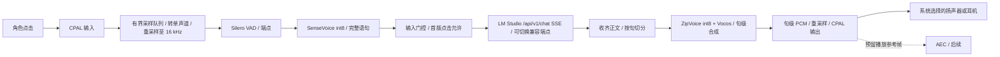

# P3 语音流水线设计：SenseVoice、ZipVoice 与 LM Studio

日期：2026-09-28。状态：**点击角色到扬声器的本地半双工代码已接通并通过文本注入的 LM Studio → ZipVoice → CPAL 扬声器试跑；真实麦克风、VAD 端点及桌面点击仍待人工验收**。这是 [语音架构](04-voice-and-compute.md) 的 P3 实施记录，P2 桌面验收仍独立进行。

## 首版边界与数据流

首版由用户点击角色头部或可选关键词开启半双工对话，启用时先播放本地提示音。音频经 VAD 端点后进入 sherpa-onnx 或 sherpa-ncnn 的 SenseVoice，识别结果先展示，再送 LM Studio。当前实现先收齐 LLM 回复，再按句顺序提交 ZipVoice；合成 PCM 进入**实际扬声器/耳机播放流**。每次播放后继续聆听，默认 8 秒无语音自动结束会话，可在面板调整。播放时不采集麦克风；再次点击头部会使旧会话失效并开启新会话，设置面板也可停止。KWS 在待机时监听，AEC、口型和增量 TTS 重叠执行尚未接入。后续配置与互动语音见[实施记录](20-p3-voice-settings-and-greetings.md)。

当前 `pet-voice-session` 定义 `InputPort/AsrPort/LlmPort/TtsPort/PlaybackPort` 五个可替换接口，独立工作线程持有 sherpa-onnx 对象，CPAL 回调只读写预分配缓冲；以后云端 ASR/TTS/LLM 或 qwentts.cpp 各自实现对应端口。`pet-inference-http` 管理 LM Studio 的 HTTP/SSE。桌宠 UI 通过受限命令启动、停止和显示文本，不传送原始 PCM。当前使用系统默认输入／输出设备；设备选择、音频时钟与口型、AEC 作为后续扩展。音频和权重留在本机，聊天正文目前不写入桌宠存档。

`TtsPort` 以 `Pcm { samples: Vec<f32>, sample_rate }` 回调传出一个或多个音频块，当前 ZipVoice 每句传出一个。未来 qwentts.cpp 的 `tts-server` 可把 `/v1/audio/speech` 的 `response_format: "pcm"` s16le 流转换为 f32 PCM 块，也可用其 C ABI；云端 TTS 走同一端口。当前 `PlaybackPort` 顺序播放每块，下一阶段若启用真正流式 TTS，应把它升级为持续输出流和有界队列，以消除块间空隙。云端 ASR 则实现 `AsrPort`，无需改角色点击、状态机和扬声器。

## 本机模型与配置

模型现位于工作区的 `models/local/`，该目录被 `.gitignore` 排除。当前按设置中的目录查找并实际加载模型，未实现 revision 与哈希校验。发行版需增加来源、版本与哈希校验，并从用户选择的模型目录或应用数据目录解析路径；禁止将本机绝对路径编入程序。

| 任务 | 模型文件 | 初始策略 |
| --- | --- | --- |
| VAD | `silero_vad.onnx` | 16 kHz，512 sample 窗，CPU 1 线程 |
| ASR | `sherpa-onnx-sense-voice-zh-en-ja-ko-yue-int8-2025-09-09/model.int8.onnx` 和 `tokens.txt` | 16 kHz 单声道完整片段、`language=auto`、CPU 1 线程 |
| TTS | `sherpa-onnx-zipvoice-distill-int8-zh-en-emilia/{encoder.int8.onnx,decoder.int8.onnx,tokens.txt,lexicon.txt,espeak-ng-data}` 和 `vocos_24khz.onnx` | 默认 CPU 8 线程，可配置 1–16；`num_steps=4`，输出采样率从合成器读取 |
| 克隆参考 | 用户选择的本地 WAV | 仅本机手动测试，音频路径和内容均不提交、复制到示例包或遥测 |
| LLM | `http://127.0.0.1:1234`、`qwen/qwen3.6-35b-a3b` | 可配置示例值；先查 `/v1/models`，再以真实生成确认可用 |

本机验证所用参考音频为单声道 44.1 kHz、约 12.96 秒。ZipVoice 的 Rust API 接收 `reference_audio` 和它的真实 `reference_sample_rate`；由适配器读取 WAV 后传入，不靠改采样率标签。若本机推理要求另一格式，由音频层真实重采样并记录处理结果。参考文字必须与音频逐字匹配，并只保存在用户本机配置中，不写入仓库。

设置面板保存参考音频路径与文本，可修改或清空；不自动上传。ZipVoice `generate_with_config` 使用该参考、`num_steps=4` 和短句文本。进度回调用于取消，不把它标记为稳定音频流；当前是**句级**合成和播放。

## Rust 接口与线程

沿用仓库本地 sherpa-onnx `rust-api-examples` 的 `sense_voice_simulate_streaming_microphone.rs`、`sense_voice.rs`、`silero_vad_remove_silence.rs`、`zipvoice_tts.rs`。Rust 绑定固定为 1.13.8；当前本地实现集中在 `pet-voice-session::local`，规模扩大后可拆成独立 `inference-sherpa` crate。原生对象在专用工作线程持有，采集与播放回调只处理 PCM，不执行模型或网络请求。

当前实现把本地 sherpa 适配器集中在 `pet-voice-session::local`，使用 `Pcm`、`TurnToken` 和五个端口 trait；下面更细的帧、时间戳与背压契约属于下一阶段接口升级目标。

- `AudioFrame { generation_id, seq, capture_sample_start, sample_rate, channels, f32_pcm }`：20 ms 内部帧；设备采样率转换和混音在工作线程做，16 kHz 给 VAD/ASR。采集队列满时记录丢帧并重置该语句，不能偷偷拼接出错误时间轴。
- `VadSegment { start_sample, end_sample, pcm_16k }`：约 500 ms 预录；静音 600 ms、语句最长 20 秒、等待首音 8 秒为起始参数。Silero `front/pop/flush` 取完整片段。需要将模型返回的边界与预录缓存时间轴对齐，避免重复送音。
- `AsrResult { turn_id, generation_id, text, language?, duration_ms }`：`OfflineRecognizer::create_stream/accept_waveform/decode/get_result`。SenseVoice 只在端点后输出 final；界面不伪造 partial。空白、仅噪声和重复短句由输入门控处理。
- `TtsRequest { turn_id, generation_id, text, voice_profile }` → `AudioChunk { sample_rate, channels, start_sample, f32_pcm }`：本地只允许一个 ZipVoice 合成任务；待播 PCM 上限约 3 秒，句数队列上限 2。超限停止继续向 TTS 提交并让上游分句器等待。
- `PlaybackPort`：CPAL 选择输出设备、将合成器采样率转换到设备格式、调用输出流 `play()`，持续消费 PCM；记录设备实际消费样本数。设备断开或格式改变时停止旧流，清队列，重建后在句边界恢复或给出故障。只有这里完成才可把 TTS 标记为“已播放”。

旧轮次失效顺序：先递增 `generation_id`，播放回调立刻拒绝旧队列；再取消 HTTP 请求并通知合成线程；迟到的 ASR、LLM、TTS 结果按轮次丢弃；口型归零。输出声学延迟要纳入实测，不能将 TTS 生成完毕当作人耳听到首音。长时间播放时输入端保持半双工，避免扬声器自声重新触发 VAD。

## LLM 兼容后端与门控扩展

`crates/inference-http` 的 `LmStudioBackend` 接受服务根 URL 或 `/v1` URL、模型 ID、超时和输出 token 限额。`probe()` 检查 `/v1/models` 是否列出精确 ID。通用 `stream_chat()` 使用 OpenAI 兼容的 `/v1/chat/completions` 与 SSE，只转发 `choices[0].delta.content`，忽略推理和工具字段。目标 Qwen 模型在本机测试中用兼容端点消耗完 512 输出 token 仍未返回正文，因此本配置优先用 `/api/v1/chat`，逐请求设 `reasoning: "off"`，只转发 `message.delta` 并以 `chat.end` 完成。设置面板可选择是否记住本次对话：开启时使用本机 LM Studio 的 `store: true` 和 `previous_response_id`，每次角色点击开启新会话会清除当前续聊 ID；关闭时 `store: false`，各轮独立。请求取消通过丢弃异步任务/HTTP 流实现；服务端实际停止与资源释放仍需单测。只有正文增量会显示和交给 TTS，推理与工具事件不会朗读。

当前用角色头部点击或可选关键词命中作为输入门控：只有有效会话的 ASR final 非空才可发 LLM。以后可在 ASR final 后接 `TranscriptClassifierGate`（小模型判断是否转交），但不做常驻识别。KWS 作为独立模型在待机监听，须评估误触发与漏触发。云端适配器同样通过 `InputPort/AsrPort/LlmPort/TtsPort/PlaybackPort` 契约替换，不让 UI 依赖具体提供商。

后续 AEC 的接口草案为 `process(capture_frame, playback_reference, clocks) -> clean_frame`。参考流应来自真正提交给输出设备的 PCM，接口携带输入/输出采样时间和设备 ID，以处理延迟、漂移和热切换。当前代码尚未接入 AEC，播放期间关闭麦克风输入；macOS、Windows、Linux 分别选择和验证平台实现。不要把 CPAL 自身视为 AEC。

## 实施顺序与验收

1. **P3a 文本后端（已实现）**：模型发现、两种 SSE 增量、错误与取消；以本机目标模型做一次原生 API 真实短回复，确认不转发推理字段。兼容端点保留供其他模型和服务使用。
2. **P3b 文件离线验证（已做功能试跑，质量待验）**：用下载的 SenseVoice 测试 WAV 跑 ASR；用 ZipVoice 模型及用户选定参考声音生成本地 WAV，核对参考文字、采样率、合成 RTF 与中文音质。测试 WAV 只留 `artifacts/local/`。
3. **P3c 音频设备和 VAD（代码已接，人工验收待做）**：系统默认输入／输出设备、麦克风采样格式转换、Silero 分段和缓冲溢出报错已接入。设备选择、设备切换恢复、完整权限提示与文件回放端点测试待做。
4. **P3d 闭环（代码已接，真实桌面验收待做）**：`voice-session` 状态机、角色点击、持续多轮至 8 秒静默超时、ASR final、LM Studio 本机会话上下文、按句 ZipVoice、真实 CPAL 扬声器输出、停止按钮和故障状态已接线。口型、生成与合成重叠、更多声音配置待做。
5. **P3e 同步及压力测试**：口型样本时钟、50 轮串轮/队列测试、100 条中文 ASR 样本和 CER、设备拔插及 LM Studio 断开。记录各阶段 p50/p95、端到端首音、音频队列最大值和 CPU/内存。未达到 [原目标](04-voice-and-compute.md#测量标准) 时保留数据与瓶颈说明。

命令行后端验证：在仓库根目录执行 `cargo run -p pet-inference-http --bin lm-studio-smoke -- http://127.0.0.1:1234 qwen/qwen3.6-35b-a3b '请用一句话打招呼。'`。不传第三个参数只做模型列表探测；在提示词后加 `--compat` 可单独试兼容端点。此命令不启动麦克风、TTS 或播放。

桌面设置中启用语音、填写本地模型目录、参考 WAV 路径及其准确文字，然后点击角色开始聆听。也可用 `cargo run -p pet-voice-session --bin voice-smoke -- MODELS_DIR REFERENCE_WAV REFERENCE_TEXT '请简短打招呼'` 单独验证 LM Studio → ZipVoice → 系统扬声器；该命令用固定文本模拟 ASR，不访问麦克风。

模型下载来源：[SenseVoice](https://github.com/k2-fsa/sherpa-onnx/releases/download/asr-models/sherpa-onnx-sense-voice-zh-en-ja-ko-yue-int8-2025-09-09.tar.bz2)、[ZipVoice](https://github.com/k2-fsa/sherpa-onnx/releases/download/tts-models/sherpa-onnx-zipvoice-distill-int8-zh-en-emilia.tar.bz2)、[Vocos](https://github.com/k2-fsa/sherpa-onnx/releases/download/vocoder-models/vocos_24khz.onnx)、[Silero VAD](https://github.com/k2-fsa/sherpa-onnx/releases/download/asr-models/silero_vad.onnx)。服务协议参考 [LM Studio 兼容端点](https://lmstudio.ai/docs/developer/openai-compat) 与 [Chat Completions](https://lmstudio.ai/docs/developer/openai-compat/chat-completions)。

### 本机首次试跑记录

- SenseVoice 对模型附带的 `yue-0.wav`（3.072 秒）输出“**两只小企鹅都有嘢食**”，识别耗时 0.103 秒，RTF 0.034；这是单样本功能试跑，不能代替中文 CER 验收。
- ZipVoice 用本地参考音频及匹配文本合成同一条 2.933 秒、24 kHz 中文短句：1 线程耗时 4.363 秒（RTF 1.487），4 线程 1.526 秒（RTF 0.520），8 线程 0.970 秒（RTF 0.331）。因此默认 8 线程、允许 1–16；仍需真实多轮并发基线和听感评分。CLI 报告输入 44.1 kHz 已重采样到 24 kHz。
- `voice-smoke` 已把本机 LM Studio 回复经 Rust ZipVoice 合成并送到 CPAL 默认扬声器，状态顺序为 listening → recognizing → thinking → synthesizing → speaking → idle；此试跑用固定文字模拟 ASR，不代表麦克风端点已验收。
- LM Studio 模型列表包含精确模型 ID；兼容端点在 512 输出 token 内没有给出正文，后端正确报告 token limit。原生端点以 `reasoning: "off"` 返回简短正文“你好。”，SSE 文本增量可用。原生请求设置 `store: false`。
