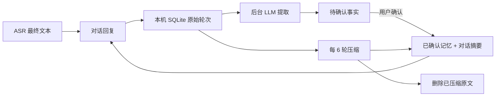

# 长期记忆：设计与首版实现

日期：2026-09-29。此功能接续 [总体架构](01-architecture.md) 和 [P3 语音配置](20-p3-voice-settings-and-greetings.md)。当前代码已接线并通过自动化测试；模型提取质量、真实语音对话与桌面界面仍需人工验收。

## 目标与边界

- 用户可以明确开启或关闭跨会话记忆，默认关闭；关闭后停止采集和检索，原有记录保留，用户可清空。
- 记忆分为本次会话短期上下文、自动压缩的对话摘要、长期事实。原有“记住本次会话上下文”只控制短期上下文，不能代替长期记忆开关。
- 自动提取的事实先列为待确认；只有用户确认或手动添加的事实可作为已确认记忆进入 LLM 提示。未压缩对话只供延续话题，不能当作已验证的个人事实。角色提起记忆时应尊重时间和不确定性。
- 对话原文默认只保留到成功提取并压缩；每满 6 轮压缩一次，更新滚动摘要并删除已压缩的原始轮次。摘要上限 1400 字符；回复按预算选取摘要、相关已确认事实和最近 2 条未压缩对话，后者只作为话题连续性线索。词项检索目前基于本地字符重合和固定记忆，不依赖额外向量模型。
- 不把原始音频写入记忆。记忆目前只来自 ASR 最终文本和 LLM 回复；ASR 错误因此可能产生错误候选，用户确认是必要的。

## 数据流

开启长期记忆后，所有 LLM 后端都走显式 Chat Completions 消息列表，本次会话最多保留最近 6 组问答。LM Studio 不再依赖服务器端的 `previous_response_id` 续接这类会话，保证删除本地记忆后不会从该续接链重新带入旧内容。关闭长期记忆时沿用原有 LM Studio 原生接口行为。

成功生成一轮回复后，原文先写入 SQLite，再用有界后台队列通知记忆工作线程。线程逐条处理数据库中的未提取轮次；队列满时原文仍留在库中，后续通知会继续处理。模型或解析失败时不把未处理轮次标为完成，下次通知或语音管线重启时重试。提取与压缩共用当前所选 LLM 后端及其密钥，所以连接外部服务时，对话文本也会发送给该服务；这由用户主动开启长期记忆后发生。

## 本地存储与迁移

`care.sqlite3` 的 `user_version` 从 2 迁到 3，新增：

| 表 | 内容 |
| --- | --- |
| `memory_state` | 开关、取消过期后台任务的 `epoch`、滚动摘要 |
| `memory_items` | 事实正文、来源（用户添加／模型建议）、确认与固定状态、时间 |
| `memory_turns` | 尚未完成提取或压缩的文字轮次、处理状态 |

写入仍由 SQLite 事务保护。语音线程和 UI 各使用独立连接，采用 WAL 与短事务；推理过程中不持有养成状态锁。关闭、删除或清空会递增 `epoch`，使处理中旧任务无法重新写入。忘记单条事实时会连同对话摘要和未压缩轮次一起清除，以防该事实从旧材料再次出现；其他已确认事实保持不变。清空删除所有事实、摘要和未压缩轮次。

## 用户界面

设置窗口新增“长期记忆”：开关、手动添加、自动建议审核、正文编辑、确认、固定、忘记、摘要查看／编辑／清空和全部清空。条目列表有独立滚动区和即时关键词筛选；删除按钮有明确的危险操作样式。忘记单条和清空全部采用界面内的两步确认，不依赖系统弹窗，操作结果显示在按钮附近。待确认事实不会作为已确认记忆用于回复。所有文本以 DOM `textContent` 或输入框值呈现，不作为 HTML 解析。与原有语音设置分别保存。

## 后续阶段与验收

1. **P3 真实链路验收**：实际说话后核查 ASR 文本、原文保存、候选提取、6 轮摘要、下一会话召回；检查关闭开关、停止、删除与后台任务交错时不复活。至少用中文和英文各一组对话。
2. **质量回归**：准备包含明确偏好、一次性请求、否定与纠正、敏感内容、相似话题的样本集，测误提取、漏提取、错误召回、摘要失真和额外推理延迟。自动建议必须继续经用户确认。
3. **检索增强**：当事实数量使字符检索明显失准时，再评估 SQLite 全文索引、embedding 和向量索引；任何索引均需随删除同步清除。当前没有向量模型或向量数据库依赖。
4. **存储与隐私增强**：发布前评估本机存档加密、备份和清理策略、云端后端的数据处理告知，以及模型服务本身可能保留的请求日志。应用的本地清空不能替代清除外部服务日志。

当前自动化测试覆盖迁移、默认关闭、未确认事实不召回、确认召回、停用、过期任务失效及删除清空；不据此宣称真实模型的抽取和摘要质量已达标。

## 本机桌面测试包

修复版 `artifacts/local/p3/DesktopPet Memory Fix.app` 已从当前 release 二进制打包，沿用上一版长期记忆测试包的 `artifacts/local/p3/memory-test-data/` 存档，方便直接核查已有条目；它不改写更早的 P3 语音测试包存档。双击打开设置窗口，先退出上一版测试包，避免两个进程同时占用麦克风或存档。角色、语音模型和参考音频仍引用本开发机上的本地资源；对话生成与自动整理需要先启动设置中配置的 LM Studio 服务。此测试包与本机路径都不提交 Git。

隔离的 QA 包已实际检查：手动添加、搜索匹配与无匹配、单条忘记及全部清空的页内确认与取消、摘要为空时的提示，以及多条目列表的独立滚动。数据库层测试覆盖实际忘记与清空；QA 未通过界面确认执行永久删除用户数据。
